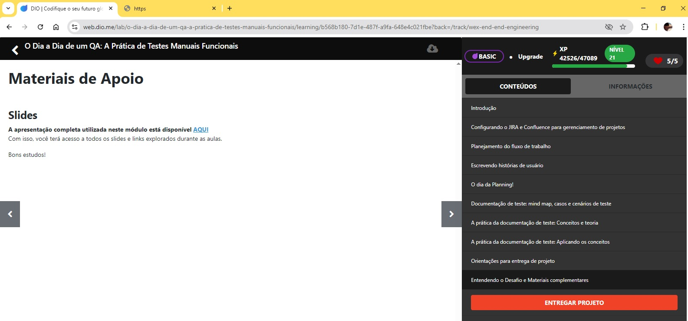
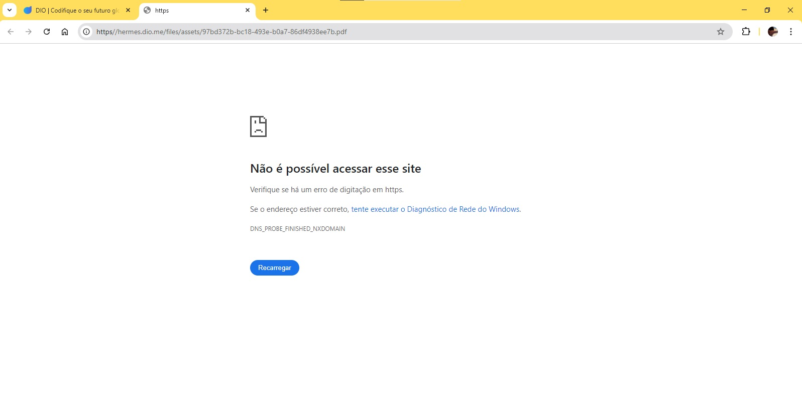

# Introdução a Qualidade de Software
## O Dia a Dia de um QA: A Prática de Testes Manuais Funcionais
### Materiais de Apoio

### Author: Macedo, Glener Diniz - Desenvolvedor Full Stack
### Data.: 9 de julho de 2025.

### Orientadora:
Carolina Louzada - Engenheira de Qualidade de Software, DIO

## Desafio de projeto
Revisar conceitos úteis para testes manuais no mundo ágil, bem como compreender e praticar atividades relativas ao dia a dia de um QA, com foco em testes manuais funcionais.

## Justificativa
Na tentativa de colcoar em prática esse desafio de projeto, me deparei com esse erro, no material de apoio, justamente em um treinamento onde se fala de realizar testes.
Ai fica a pergunta que não quer se calar. Será que fizeram um teste, nesse projeto de treinamento?

  

